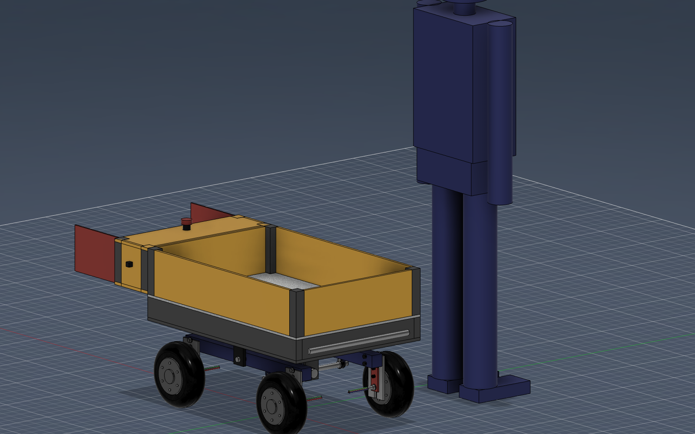
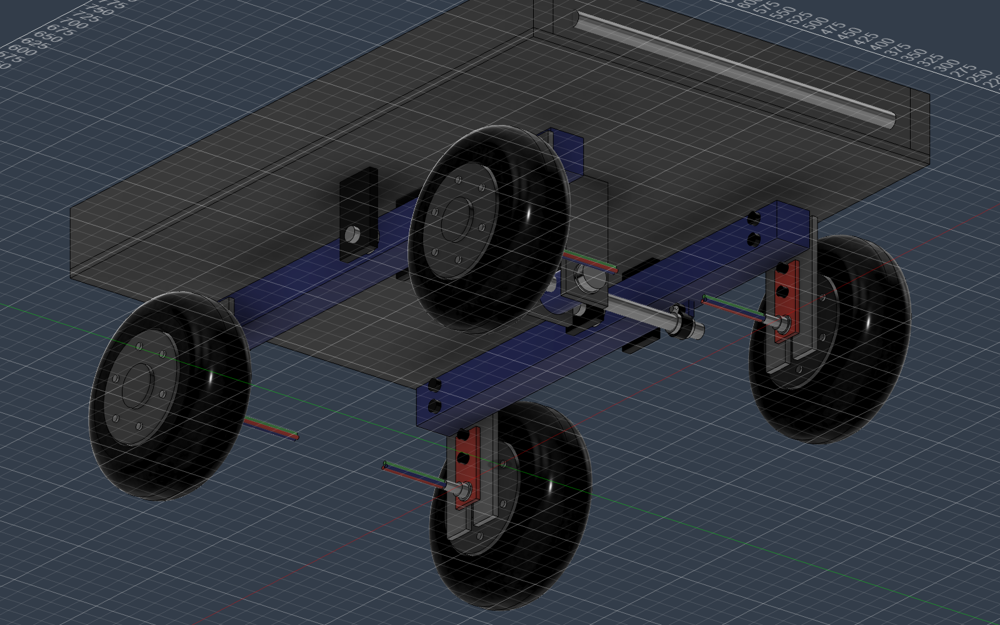

# Payload Rover

A parametric CAD model of a **skid-steer, ~200 kg payload rover** — four single-sided
hub motors, a welded square-tube payload bay, a rear electronics cabinet driven by an
**ESP32-based PCB**, and a **walking-beam rocker suspension** with a central
differential. Everything is modelled in Autodesk Fusion, generated entirely by code
via the Fusion MCP.



## What's in the machine

| Subsystem | Description |
|---|---|
| **Drive** | 4× single-sided 10" hub motors (Robokits RKI 9051 class, 2.30 kg), skid-steered — no steering linkage |
| **Chassis** | Steel base plate + side rails, 320 mm ground clearance (sized for suspension travel) |
| **Payload bay** | Welded MS 40 mm square-tube columns + steel sheet panels, galvanised deck |
| **Electronics cabinet** | Rear, full-width: battery, vertical ESP32 control PCB, 4 motor drivers, cable glands, power switch, E-stop on top, twin hinged doors |
| **Suspension** | One MS 50×50 RHS walking-beam arm per side, bolted flush to the hub-motor dropout plates; each arm see-saws on a Ø20 EN8 shaft in bearings; a clevis-mounted differential bar with ball-jointed drop-links holds the body at the mean pitch (rocker-bogie style) |



The suspension is a real mechanism in the model — revolute joints at the two arm
pivots and the differential trunnion, with each side's wheels rigid-grouped to its
arm — so you can drag any wheel in Fusion and watch the rover articulate, or render
the bundled motion studies (`media/rocker_motion.gif`, `media/diff_pivot_motion.gif`,
regenerable via `fusion/payload_car/motion.py`).

## Repo layout

```
CLAUDE.md            project conventions (uv-only Python, build via Fusion MCP)
fusion/              uv project + all model code (see fusion/README.md)
└── payload_car/     builder.py · wheel_mount.py · assemble.py · motion.py · cli.py
components/          exported .f3d artifacts (untracked; snapshots attached to GitHub Releases)
docs/                README images
media/               rendered animations (untracked; regenerable)
```

## Build it

Everything is parametric (68 Fusion user parameters) and code-generated:

```bash
cd fusion
uv run payload-car validate     # offline-check every parameter expression
uv run payload-car params       # print the parameter tables
uv run payload-car bootstrap    # emit the Fusion/MCP script that assembles the rover
```

With Fusion open and the MCP connected, run the bootstrap snippet — it builds the car,
inserts the four wheel modules, creates the suspension joints, cloud-saves and exports
`components/payload_car_4wd.f3d`. Full instructions in [fusion/README.md](fusion/README.md).
